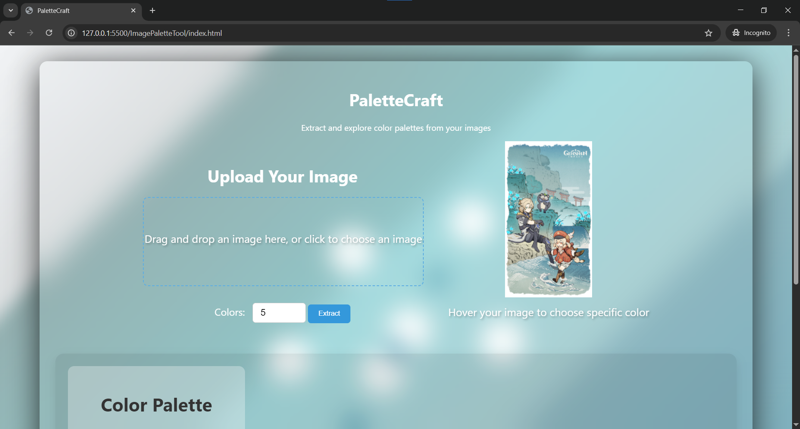

# PaletteCraft - Image Color Palette Extractor

PaletteCraft is a web application designed to extract and explore color palettes from uploaded images. It provides a user-friendly interface to easily generate color schemes, offering various color formats for design and creative projects.

## Features

-   **Image Upload:** Drag-and-drop or file selection for easy image uploading.
-   **Color Extraction:** Adjustable number of colors to extract from the image.
-   **Color Format Selection:** Choose between HEX, HSL (normalized and full), and RGB (normalized and full) color formats.
-   **Interactive Color Picking:** Hover over the image preview to pick specific colors.
-   **Palette Display:** Displays the extracted color palette in a grid format with copy functionality.
-   **Loading Indicators:** Visual feedback during image processing and uploading.
-   **Responsive Design:** Ensures a seamless experience across different devices.

## Technologies Used

-   **HTML5, CSS3, JavaScript:** For the core structure, styling, and interactivity of the web application.
-   **Canvas API:** Used for image manipulation and color extraction.
-   **JavaScript Modules:** For modular and maintainable code.
-   **ldrs (Loading Indicators):** For modern and customizable loading animations.

## Getting Started

To use PaletteCraft, simply open the `index.html` file in your web browser. You can then upload an image and extract its color palette using the provided controls.

## Usage

1.  **Upload Image:** Drag and drop an image into the designated area or click to select a file.
2.  **Adjust Colors:** Use the input field to specify the number of colors to extract.
3.  **Extract Palette:** Click the "Extract" button to generate the color palette.
4.  **Select Color Format:** Choose your preferred color format from the dropdown menu.
5.  **Copy Colors:** Click on a color swatch in the palette to copy its value.
6.  **Interactive Picking:** Hover the image to see and select specific colors.

## File Structure

-   `index.html`: Main HTML file for the application.
-   `statics/css/`: Contains CSS files for styling.
    -   `background.css`: Styles for the background effects.
    -   `upload.css`: Styles for the upload section.
    -   `palette.css`: Styles for the color palette section.
    -   `tooltip.css`: Styles for the color tooltips.
-   `statics/js/`: Contains JavaScript files for functionality.
    -   `event.js`: Handles event listeners and DOM interactions.
    -   `color.js`: Functions for color format conversion.
    -   `tooltip.js`: Manages the color tooltips.
    -   `imageprocessing.js`: Handles image processing and canvas operations.
    -   `paletteprocessing.js`: Generates and manages the color palette.
-   `favicon.png`: Application favicon.

## Dependencies

-   `ldrs` (Loading Indicators): Used for loading animations.

## Contributing

Contributions are welcome! Please feel free to submit pull requests or open issues to improve PaletteCraft.

## License

This project is open-source and available under the [MIT License](LICENSE).