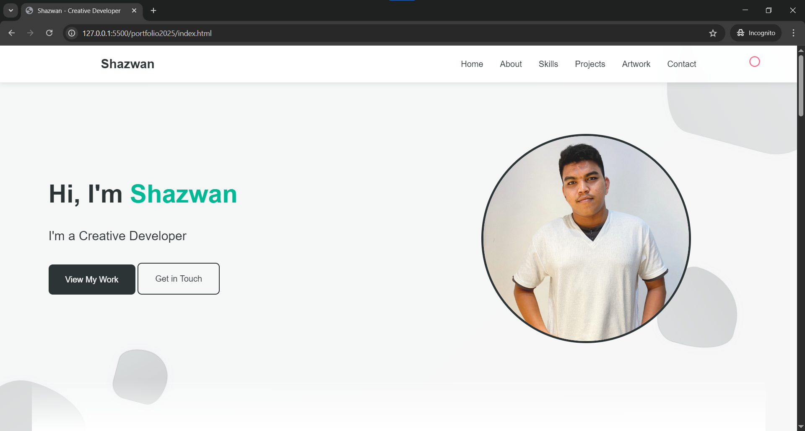

<h1 align="center">Shazwan</h1>
<h3 align="center">AI & Automation Engineer | Creative Developer | Digital Architect</h3>

Building scalable digital solutions with a user-first mindset. Passionate about AI, automation, and creating impactful user experiences.

- 👨‍💻 Portfolio: [shazwanx9.github.io/Portfolio2025/](https://shazwanx9.github.io/Portfolio2025/)
- 📫 Contact: **shazwanx9@gmail.com**

<h3 align="left">Key Skills:</h3>

- **AI Solutions & Automation**
- **Full-Stack Development** (Python, JavaScript, React, Django, etc.)
- **UI/UX Design**
- **Mobile App Development** (Flutter, Android)

<h3 align="left">Technologies:</h3>

- **Core:** Python, JavaScript, React, Django, Flutter, Android, SQL/NoSQL Databases.
- **AI/ML:** OpenCV, TensorFlow, basic ML/AI workflows.