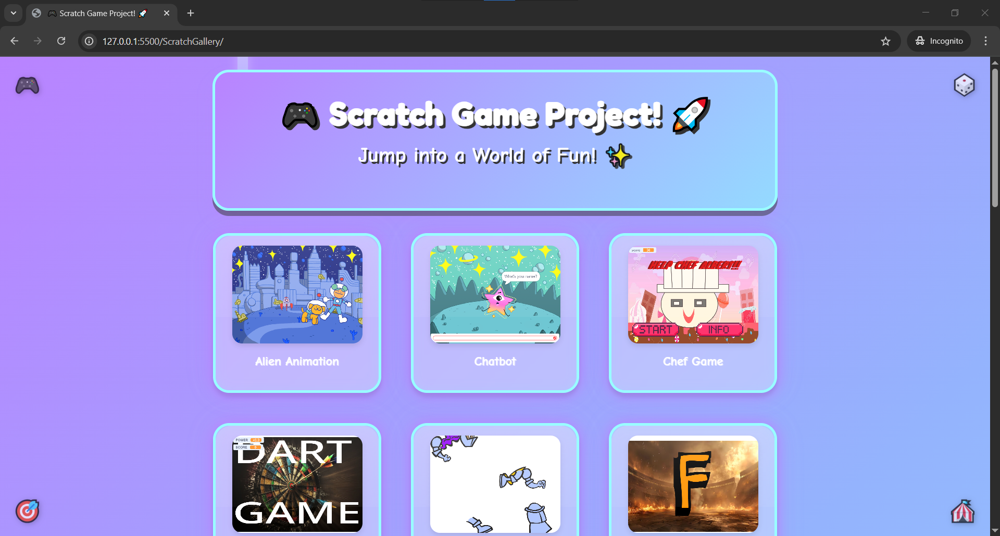

# Scratch Game Gallery

This project showcases a collection of interactive games and animations created using Scratch, a block-based visual programming language. It's designed to be a fun and engaging way to explore fundamental programming concepts and creative storytelling.

## Features

-   **Interactive Games:** A variety of playable games with different mechanics and themes.
-   **Animations:** Creative animations demonstrating visual storytelling and movement.
-   **Educational Content:** Projects that illustrate basic programming concepts like loops, conditionals, and variables.
-   **User-Friendly Interface:** Easy navigation and interaction with the Scratch projects.
-   **Fun and Engaging Design:** A visually appealing layout with playful elements.

## Technologies Used

-   **Scratch:** The primary platform for creating the games and animations.
-   **HTML, CSS, JavaScript:** For the web interface and embedding Scratch projects.
-   **Embedded Scratch Projects:** Projects are embedded using the Scratch embed feature.

## Getting Started

To view and interact with the Scratch projects, simply open the `index.html` file in your web browser. You can then browse the gallery and play the games or watch the animations.

## Usage

1.  **Open `index.html`:** Launch the file in your preferred web browser.
2.  **Browse the Gallery:** Explore the displayed Scratch projects.
3.  **Interact:** Play the games or watch the animations directly in the browser.

## File Structure

-   `index.html`: Main HTML file for the gallery.
-   `statics/styles.css`: CSS file for styling the gallery.
-   `statics/script.js`: JavaScript file for embedding and managing Scratch projects.
-   `assets/favicon.png`: Favicon for the website.

## Contributing

Contributions are welcome! If you have any Scratch projects you'd like to add or improvements to suggest, please feel free to submit a pull request or open an issue.

## License

This project is open-source and available under the [MIT License](LICENSE).